## Diagrama

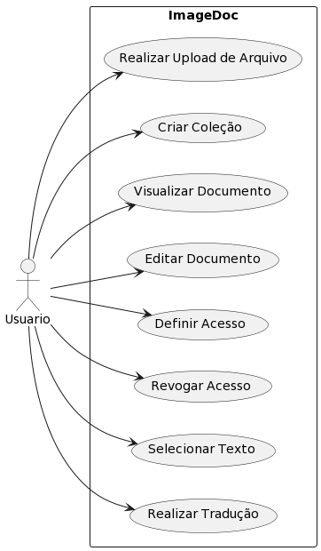

### **Caso de Uso: Realizar Upload de Arquivo**

- **Caso de Uso Principal:** Realizar o upload de um arquivo (imagem ou PDF).
- **Resumo:** Este caso de uso descreve a interação do usuário ao fazer o upload de um arquivo (imagem ou PDF) para ser armazenado em uma coleção na aplicação.
- **Pré-condições:**
  - O usuário deve estar autenticado no sistema.
  - O usuário deve ter acesso à funcionalidade de upload de arquivos.
  - O usuário deve estar na página de upload de arquivos.
- **Pós-condições:**
  - O arquivo é carregado com sucesso e armazenado na coleção selecionada.
- **Fluxo Principal:**
  1. O usuário acessa a página de upload de arquivos.
  2. O sistema exibe a interface de upload.
  3. O usuário seleciona o arquivo desejado em seu dispositivo.
  4. O usuário clica no botão "Enviar" para iniciar o processo de upload.
  5. O sistema valida o arquivo quanto a tamanho, formato e outros critérios.
  6. O sistema armazena o arquivo no armazenamento de arquivos definido.
  7. O sistema registra as informações do arquivo (metadados) no MongoDB, associando-o à coleção selecionada.
- **Fluxo Alternativo:**
  - No passo 5, se o arquivo não atender aos critérios de validação, o sistema exibe uma mensagem de erro ao usuário, informando que o upload não foi bem-sucedido. O fluxo retorna ao passo 3.
- **Exceções:**
  - Se o usuário não estiver autenticado, o sistema exibirá uma mensagem solicitando o login antes de permitir o upload.
  - Se ocorrer uma falha técnica durante o upload, o sistema exibirá uma mensagem de erro e fornecerá orientações sobre como proceder.
- **Requisitos:**
  - Acesso à interface de upload de arquivos.
  - Funcionalidade de armazenamento de arquivos implementada.
  - Validação de formato e tamanho do arquivo.
  - Registro correto dos metadados do arquivo no MongoDB.

```
@startuml
|Início|
start
:Usuário acessa página de upload;
:Exibir interface de upload;
:Usuário seleciona arquivo;
|Validar Arquivo|
if (Arquivo válido?) then (Sim)
  :Enviar arquivo para armazenamento;
else (Não)
  :Exibir mensagem de erro;
endif
|Armazenar Arquivo|
:Armazenar arquivo;
:Registrar metadados do arquivo;
|Upload Concluído|
stop
@enduml
```

- **Diagrama de Sequencia**:

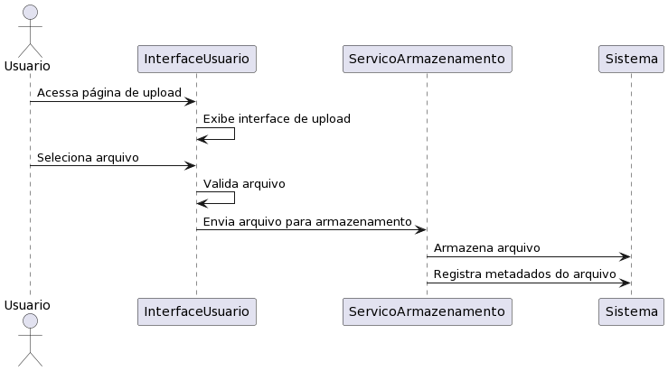

- **Diagrama de Atividades**:

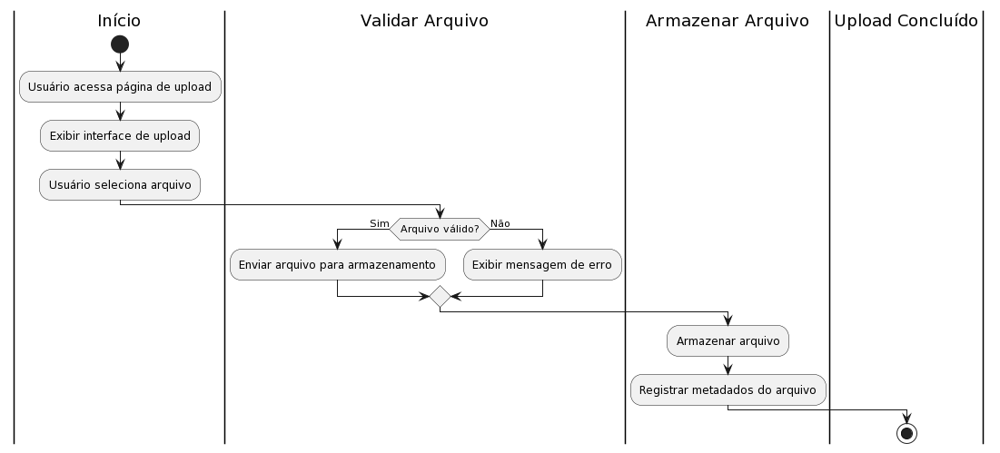

---

### **Caso de Uso: Criar Coleção**

- **Caso de Uso Principal:** Criar uma nova coleção de documentos e associar um arquivo a ela.
- **Resumo:** Este caso de uso descreve como o usuário cria uma nova coleção de documentos na aplicação e associa um arquivo (previamente carregado) a essa coleção.
- **Pré-condições:**
  - O usuário deve estar autenticado no sistema.
  - O usuário deve ter acesso à funcionalidade de criação de coleções.
  - O usuário deve estar na página de criação de coleções.
  - Um arquivo já deve ter sido carregado na aplicação.
- **Pós-condições:**
  - Uma nova coleção é criada no sistema e associada ao arquivo selecionado.
- **Fluxo Principal:**
  1. O usuário acessa a página de criação de coleções.
  2. O sistema exibe a interface de criação de coleções.
  3. O usuário fornece um nome e uma descrição para a nova coleção.
  4. O sistema lista os arquivos disponíveis para associação.
  5. O usuário seleciona um arquivo previamente carregado para associar à coleção.
  6. O usuário confirma a criação da coleção.
  7. O sistema cria a nova coleção no MongoDB e associa o arquivo a ela.
- **Fluxo Alternativo:**
  - No passo 6, se o usuário optar por não criar a coleção após a seleção do arquivo, o fluxo é encerrado.
- **Exceções:**
  - Se o usuário não estiver autenticado, o sistema exibirá uma mensagem solicitando o login antes de permitir a criação da coleção.
  - Se não houver arquivos carregados na aplicação, o sistema informará ao usuário que não é possível criar uma coleção sem um arquivo associado.
- **Requisitos:**

  - Acesso à interface de criação de coleções.
  - Arquivos previamente carregados na aplicação.
  - Funcionalidade de armazenamento e associação de arquivos implementada.
  - Correta criação e associação da coleção no MongoDB.

- **Diagrama de Sequencia:**

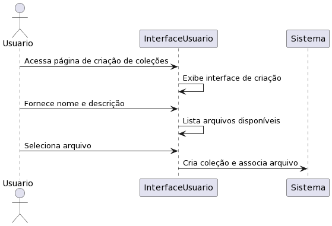

---

### **Caso de Uso: Visualizar Documento**

- **Caso de Uso Principal:** Visualizar o conteúdo de um documento na coleção.
- **Resumo:** Este caso de uso descreve como o usuário visualiza o conteúdo de um documento específico na coleção. Ele também pode escolher estender o caso de uso para realizar edições ou traduções no documento visualizado.
- **Pré-condições:**
  - O usuário deve estar autenticado no sistema.
  - O usuário deve ter acesso à funcionalidade de visualização de documentos.
  - O usuário deve estar na página de visualização de documentos.
  - Um documento deve estar disponível para visualização na coleção.
- **Pós-condições:**
  - O usuário visualiza o conteúdo do documento.
- **Fluxo Principal:**
  1. O usuário acessa a página de visualização de documentos.
  2. O sistema exibe a interface de visualização de documentos.
  3. O usuário seleciona o documento que deseja visualizar.
  4. O sistema exibe o conteúdo do documento na interface.
- **Estende:** Editar Documento (Se o usuário escolher editar o documento após a visualização)
  1. O usuário escolhe a opção de editar o documento após visualizá-lo.
  2. O sistema estende o caso de uso para a edição do documento.
- **Estende:** Realizar Tradução (Se o usuário escolher traduzir o texto após selecioná-lo)
  1. O usuário seleciona um trecho de texto para tradução após visualizar o documento.
  2. O sistema estende o caso de uso para a realização de tradução.
- **Exceções:**
  - Se o usuário não estiver autenticado, o sistema exibirá uma mensagem solicitando o login antes de permitir a visualização do documento.
  - Se não houver documentos disponíveis para visualização, o sistema informará ao usuário que não é possível realizar a visualização.
- **Requisitos:**

  - Acesso à interface de visualização de documentos.
  - Documentos disponíveis para visualização.
  - Implementação da funcionalidade de visualização de documentos.
  - Integração com os casos de uso de edição e tradução, caso o usuário escolha estendê-los.

- **Diagrama de Sequencia**:

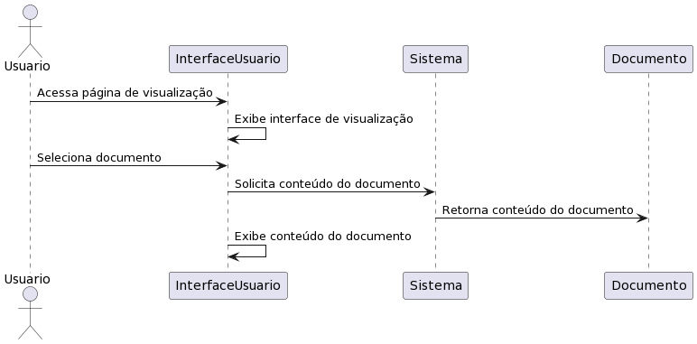

---

### **Caso de Uso: Editar Documento**

- **Caso de Uso Principal:** Realizar edições no conteúdo de um documento na coleção.
- **Resumo:** Este caso de uso descreve como o usuário realiza edições no conteúdo de um documento específico na coleção. Durante o processo de edição, o usuário tem a opção de aplicar as edições feitas.
- **Pré-condições:**
  - O usuário deve estar autenticado no sistema.
  - O usuário deve ter acesso à funcionalidade de edição de documentos.
  - O usuário deve estar na página de edição de documentos.
  - Um documento deve estar disponível para edição na coleção.
- **Pós-condições:**
  - As edições feitas pelo usuário são aplicadas ao documento.
- **Fluxo Principal:**
  1. O usuário acessa a página de edição de documentos.
  2. O sistema exibe a interface de edição de documentos.
  3. O usuário seleciona o documento que deseja editar.
  4. O sistema exibe o conteúdo do documento na interface de edição.
  5. O usuário realiza as edições desejadas no documento.
  6. O sistema registra as edições feitas pelo usuário.
- **Inclui:** Aplicar Edições (Parte do fluxo de edição)
  1. Após realizar as edições, o usuário escolhe aplicar as mudanças.
  2. O sistema inclui o caso de uso de aplicação de edições.
- **Exceções:**
  - Se o usuário não estiver autenticado, o sistema exibirá uma mensagem solicitando o login antes de permitir a edição do documento.
  - Se não houver documentos disponíveis para edição, o sistema informará ao usuário que não é possível realizar a edição.
- **Requisitos:**

  - Acesso à interface de edição de documentos.
  - Documentos disponíveis para edição.
  - Implementação da funcionalidade de edição de documentos.
  - Integração com o caso de uso de aplicação de edições.

- **Diagrama de Sequencia**:

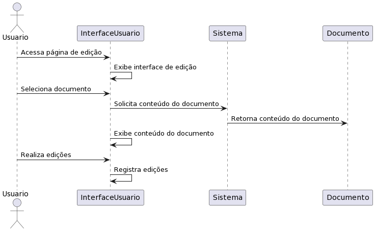

---

### **Caso de Uso: Definir Acesso**

- **Caso de Uso Principal:** Definir as permissões de acesso de outros usuários a uma coleção.
- **Resumo:** Este caso de uso descreve como um usuário com permissões de gerenciamento define as permissões de acesso para outros usuários em uma coleção específica.
- **Pré-condições:**
  - O usuário deve estar autenticado no sistema.
  - O usuário deve ter permissões de gerenciamento sobre a coleção.
  - A coleção deve estar disponível para definir acesso.
  - Outros usuários devem estar cadastrados no sistema.
- **Pós-condições:**
  - As permissões de acesso são definidas para os usuários selecionados na coleção.
- **Fluxo Principal:**
  1. O usuário acessa a funcionalidade de gerenciamento de acesso à coleção.
  2. O sistema exibe a lista de usuários cadastrados.
  3. O usuário seleciona os usuários para os quais deseja definir permissões.
  4. O sistema exibe as opções de permissões (leitura, edição, etc.).
  5. O usuário escolhe as permissões para cada usuário selecionado.
  6. O sistema registra as permissões definidas.
- **Exceções:**
  - Se o usuário não estiver autenticado, o sistema solicitará o login antes de permitir a definição de acesso.
  - Se o usuário não tiver permissões de gerenciamento para a coleção, o sistema informará que ele não tem autorização para realizar essa ação.
  - Se não houver usuários cadastrados no sistema, o sistema informará que não é possível definir acesso.
- **Requisitos:**

  - Funcionalidade de gerenciamento de acesso à coleção.
  - Lista de usuários cadastrados.
  - Implementação das opções de permissões.
  - Registros das permissões definidas.

- **Diagrama de Sequencia**:

## 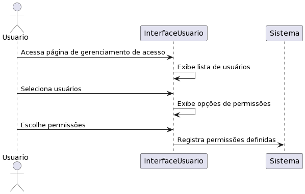

### **Caso de Uso: Revogar Acesso**

- **Caso de Uso Principal:** Revogar as permissões de acesso de outros usuários a uma coleção.
- **Resumo:** Este caso de uso descreve como um usuário com permissões de gerenciamento revoga as permissões de acesso de outros usuários em uma coleção específica.
- **Pré-condições:**
  - O usuário deve estar autenticado no sistema.
  - O usuário deve ter permissões de gerenciamento sobre a coleção.
  - A coleção deve estar disponível para revogar acesso.
  - Outros usuários devem ter permissões definidas na coleção.
- **Pós-condições:**
  - As permissões de acesso são revogadas para os usuários selecionados na coleção.
- **Fluxo Principal:**
  1. O usuário acessa a funcionalidade de gerenciamento de acesso à coleção.
  2. O sistema exibe a lista de usuários cadastrados na coleção com permissões definidas.
  3. O usuário seleciona os usuários para os quais deseja revogar permissões.
  4. O sistema exibe as opções de permissões atualmente definidas para cada usuário.
  5. O usuário confirma a revogação das permissões.
  6. O sistema registra a revogação das permissões.
- **Exceções:**
  - Se o usuário não estiver autenticado, o sistema solicitará o login antes de permitir a revogação de acesso.
  - Se o usuário não tiver permissões de gerenciamento para a coleção, o sistema informará que ele não tem autorização para realizar essa ação.
  - Se não houver usuários com permissões definidas na coleção, o sistema informará que não é possível revogar acesso.
- **Requisitos:**

  - Funcionalidade de gerenciamento de acesso à coleção.
  - Lista de usuários cadastrados na coleção com permissões definidas.
  - Implementação das opções de permissões.
  - Registros das revogações de permissões.

- **Diagrama de Sequencia**:

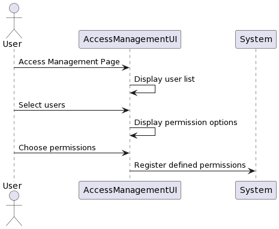

---

### **Caso de Uso: Selecionar Texto**

- **Caso de Uso Principal:** Selecionar um trecho de texto em um documento para ações adicionais.
- **Resumo:** Este caso de uso descreve como o usuário tem a capacidade de selecionar um trecho específico de texto em um documento. Essa seleção permite que o usuário realize ações adicionais, como a tradução do trecho selecionado.
- **Pré-condições:**
  - O usuário deve estar autenticado no sistema.
  - O usuário deve ter acesso ao documento que contém o texto.
  - O documento deve estar disponível para visualização.
- **Pós-condições:**
  - O trecho de texto selecionado fica pronto para a execução de ações adicionais.
- **Fluxo Principal:**
  1. O usuário acessa o documento que deseja visualizar.
  2. O usuário seleciona um trecho específico de texto no documento.
  3. O sistema destaca visualmente o trecho selecionado.
- **Estende:** Realizar Tradução (Se o usuário escolher traduzir o texto após selecioná-lo)
  1. O usuário escolhe traduzir o trecho de texto após tê-lo selecionado.
  2. O sistema estende o caso de uso para a realização da tradução do trecho selecionado.
- **Exceções:**
  - Se o usuário não estiver autenticado, o sistema solicitará o login antes de permitir a seleção de texto.
  - Se o usuário não tiver acesso ao documento ou se o documento não estiver disponível para visualização, o sistema informará que a seleção de texto não é possível.
- **Requisitos:**

  - Implementação da funcionalidade de seleção de texto.
  - Destaque visual para o trecho selecionado.

- **Diagrama de Sequencia**:

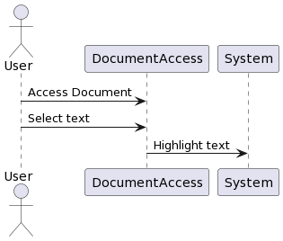

---

### **Caso de Uso: Realizar Tradução**

- **Caso de Uso Principal:** Traduzir um trecho de texto em um documento.
- **Resumo:** Este caso de uso descreve como o usuário realiza a tradução de um trecho específico de texto presente em um documento. O usuário também tem a opção de aplicar edições no texto traduzido.
- **Pré-condições:**
  - O usuário deve estar autenticado no sistema.
  - O usuário deve ter acesso ao documento que contém o texto a ser traduzido.
  - O documento deve estar disponível para visualização.
  - O usuário deve ter selecionado um trecho de texto para tradução.
- **Pós-condições:**
  - O trecho de texto traduzido é exibido e o usuário tem a opção de aplicar edições.
- **Fluxo Principal:**
  1. O usuário acessa o documento que contém o trecho de texto que deseja traduzir.
  2. O usuário seleciona o trecho específico de texto a ser traduzido.
  3. O sistema exibe uma opção para realizar a tradução do trecho selecionado.
  4. O usuário escolhe realizar a tradução.
  5. O sistema exibe o trecho de texto traduzido.
- **Inclui:** Aplicar Edições (Parte do fluxo de tradução)
  1. Após a tradução, o usuário tem a opção de aplicar edições ao trecho traduzido.
  2. O sistema inclui o caso de uso de aplicar edições no trecho traduzido.
- **Exceções:**
  - Se o usuário não estiver autenticado, o sistema solicitará o login antes de permitir a tradução do trecho de texto.
  - Se o usuário não tiver acesso ao documento ou se o documento não estiver disponível para visualização, o sistema informará que a tradução não é possível.
  - Se o usuário não tiver selecionado um trecho de texto para tradução, o sistema informará que a tradução não pode ser realizada.
- **Requisitos:**

  - Implementação da funcionalidade de tradução de texto.
  - Opção de aplicar edições no trecho traduzido.

- **Diagrama de Sequencia**:

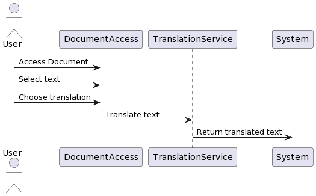

---

### **Caso de Uso: Selecionar Documentos**

- **Caso de Uso Principal:** Selecionar documentos para aplicar edições em lote.
- **Resumo:** Este caso de uso descreve como o usuário seleciona um ou mais documentos em uma coleção para aplicar edições em lote. Ele estende o caso de uso "Escolher Edições em Lote" para evitar duplicação de lógica.
- **Pré-condições:**
  - O usuário deve estar autenticado no sistema.
  - O usuário deve ter acesso à funcionalidade de seleção de documentos para edições em lote.
  - O usuário deve estar na página de seleção de documentos.
- **Pós-condições:**
  - Os documentos selecionados estão prontos para receber as edições em lote.
- **Fluxo Principal:**
  1. O usuário acessa a página de seleção de documentos para edições em lote.
  2. O sistema exibe a interface de seleção de documentos.
  3. O usuário seleciona um ou mais documentos que deseja incluir no processo de edições em lote.
- **Estende:** Escolher Edições em Lote (Parte do fluxo de seleção de documentos)
  1. O usuário escolhe os documentos que deseja incluir no processo de edições em lote.
  2. O sistema estende o caso de uso de escolha de edições em lote.
- **Exceções:**
  - Se o usuário não estiver autenticado, o sistema solicitará o login antes de permitir a seleção de documentos para edições em lote.
  - Se o usuário não tiver acesso à funcionalidade de seleção de documentos, o sistema informará que a ação não é permitida.
  - Se não houver documentos disponíveis para seleção, o sistema informará que não é possível realizar a seleção.
- **Requisitos:**

  - Implementação da funcionalidade de seleção de documentos para edições em lote.
  - Integração com o caso de uso de escolher edições em lote.

- **Diagrama de Sequencia**:


---

### **Caso de Uso: Escolher Edições em Lote**

- **Caso de Uso Principal:** Escolher as edições a serem aplicadas em vários documentos selecionados.
- **Resumo:** Este caso de uso descreve como o usuário escolhe quais edições deseja aplicar em um conjunto de documentos selecionados. Ele faz parte do processo de aplicação de edições em lote.
- **Pré-condições:**
  - O usuário deve estar autenticado no sistema.
  - O usuário deve ter selecionado um ou mais documentos para edições em lote.
  - O usuário deve estar na página de escolha de edições em lote.
- **Pós-condições:**
  - As edições selecionadas estão prontas para serem aplicadas nos documentos selecionados.
- **Fluxo Principal:**
  1. O usuário acessa a página de escolha de edições em lote.
  2. O sistema exibe a interface de escolha de edições em lote.
  3. O usuário seleciona as edições que deseja aplicar nos documentos selecionados.
- **Inclui:** Selecionar Documentos (Parte do fluxo de escolha de edições em lote)
  1. O usuário escolhe os documentos nos quais deseja aplicar edições em lote.
  2. O sistema inclui o caso de uso de seleção de documentos.
- **Exceções:**
  - Se o usuário não estiver autenticado, o sistema solicitará o login antes de permitir a escolha de edições em lote.
  - Se o usuário não tiver selecionado nenhum documento, o sistema informará que é necessário selecionar documentos antes de escolher as edições.
  - Se não houver edições disponíveis para escolha, o sistema informará que não é possível realizar a escolha.
- **Requisitos:**

  - Implementação da funcionalidade de escolha de edições em lote.
  - Integração com o caso de uso de seleção de documentos.

- **Diagrama de Sequencia**:

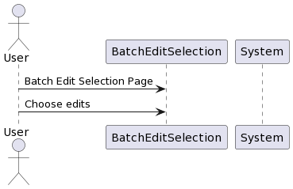

---

### **Caso de Uso: Aplicar Edições**

- **Caso de Uso Principal:** Aplicar as edições escolhidas em todos os documentos selecionados.
- **Resumo:** Este caso de uso descreve como o usuário aplica as edições escolhidas em um conjunto de documentos previamente selecionados. Ele faz parte do processo de edição em lote.
- **Pré-condições:**
  - O usuário deve estar autenticado no sistema.
  - O usuário deve ter selecionado um ou mais documentos nos quais deseja aplicar edições.
  - O usuário deve ter escolhido as edições a serem aplicadas nos documentos selecionados.
  - O usuário deve estar na página de aplicação de edições.
- **Pós-condições:**
  - As edições selecionadas são aplicadas a todos os documentos escolhidos.
- **Fluxo Principal:**
  1. O usuário acessa a página de aplicação de edições.
  2. O sistema exibe a interface de aplicação de edições.
  3. O sistema exibe a lista de documentos selecionados e as edições escolhidas pelo usuário.
  4. O usuário confirma a aplicação das edições nos documentos.
  5. O sistema aplica as edições em cada documento selecionado.
- **Inclui:** Selecionar Documentos (Parte do fluxo de aplicação de edições)
  1. O usuário escolhe os documentos nos quais deseja aplicar as edições.
  2. O sistema inclui o caso de uso de seleção de documentos.
- **Exceções:**
  - Se o usuário não estiver autenticado, o sistema solicitará o login antes de permitir a aplicação de edições.
  - Se o usuário não tiver selecionado nenhum documento, o sistema informará que é necessário selecionar documentos antes de aplicar as edições.
  - Se não houver edições escolhidas, o sistema informará que é necessário escolher as edições antes de aplicá-las.
- **Requisitos:**

  - Implementação da funcionalidade de aplicação de edições em lote.
  - Integração com o caso de uso de seleção de documentos

- **Diagrama de Sequencia**:

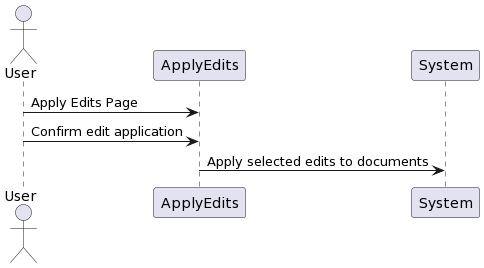
