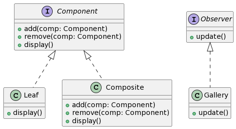

# Proposta 1: Uso do Composite e Observer Patterns

## Problema Resolvido:

- Gerenciar coleções de documentos (imagens e PDFs) de forma hierárquica.
- Manter o estado atualizado das galerias automaticamente.

## Sample:

Imagine que os usuários possam criar álbuns que contêm tanto documentos individuais quanto outros álbuns. Ao adicionar ou remover documentos em um álbum, as galerias precisam ser atualizadas.

## Classes e Objetos:

1. **Component (Composite Pattern)**

- Interface que define operações comuns para folhas e composites.
- Métodos: add, remove, display

2. **Leaf (Composite Pattern)**

- Representa os elementos individuais (documentos) da hierarquia.
- Métodos: display

3. **Composite (Composite Pattern)**

- Contém folhas (documentos individuais) ou outros composites (subálbuns).
- Métodos: add, remove, display

4. **Gallery (Observer Pattern)**

- Observa as mudanças nos documentos e álbuns, atualizando automaticamente quando ocorrem mudanças.

## Diagrama

```
@startuml

interface Component {
    + add(comp: Component)
    + remove(comp: Component)
    + display()
}

class Leaf {
    + display()
}

class Composite {
    + add(comp: Component)
    + remove(comp: Component)
    + display()
}

interface Observer {
    + update()
}

class Gallery {
    + update()
}

Component <|.. Leaf
Component <|.. Composite
Observer <|.. Gallery

@enduml

```



Aqui, o Composite Pattern é usado para representar hierarquias de álbuns e documentos, enquanto o Observer Pattern garante que as galerias sejam atualizadas quando ocorrem alterações.
