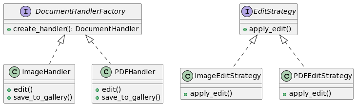

# Proposta 2: Uso do Factory Method e Strategy Patterns

## Problema Resolvido:

- Criar handlers de documentos de acordo com o formato do arquivo.
- Aplicar estratégias de edição específicas para cada tipo de documento.

## Sample:

Você deseja criar uma estrutura flexível para criar handlers de documentos e permitir a escolha de estratégias de edição específicas para cada tipo de documento.

## Classes e Objetos:

1. **DocumentHandlerFactory (Factory Method)**

- Interface para criar handlers de documentos.
- Métodos: create_handler

2. **ImageHandler (ConcreteProduct)**

- Manipula arquivos de imagem.
- Métodos: edit, save_to_gallery

3. **PDFHandler (ConcreteProduct)**

- Manipula arquivos PDF.
- Métodos: edit, save_to_gallery

4. **EditStrategy (Strategy Pattern)**

- Interface para estratégias de edição.
- Métodos: apply_edit

5. **ImageEditStrategy (ConcreteStrategy)**

- Implementa estratégias de edição para imagens.
- Métodos: apply_edit

6. **PDFEditStrategy (ConcreteStrategy)**

- Implementa estratégias de edição para PDFs.
- Métodos: apply_edit

## Diagrama

```
@startuml

interface DocumentHandlerFactory {
    + create_handler(): DocumentHandler
}

class ImageHandler {
    + edit()
    + save_to_gallery()
}

class PDFHandler {
    + edit()
    + save_to_gallery()
}

interface EditStrategy {
    + apply_edit()
}

class ImageEditStrategy {
    + apply_edit()
}

class PDFEditStrategy {
    + apply_edit()
}

DocumentHandlerFactory <|.. ImageHandler
DocumentHandlerFactory <|.. PDFHandler

EditStrategy <|.. ImageEditStrategy
EditStrategy <|.. PDFEditStrategy

@enduml

```



Nesta proposta, o Factory Method Pattern é usado para criar handlers de documentos de acordo com o formato, enquanto o Strategy Pattern é empregado para aplicar diferentes estratégias de edição para cada tipo de documento.
