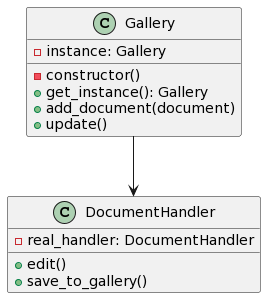

# Proposta 3: Uso do Singleton e Proxy Patterns

## Problema Resolvido:

- Garantir a criação de apenas uma instância da galeria.
- Controlar o acesso aos handlers de documentos e adicionar funcionalidades extras.

## Sample:

Você quer garantir que apenas uma instância da galeria seja criada e também deseja controlar o acesso aos handlers de documentos, adicionando funcionalidades extras como logging.

## Classes e Objetos:

1. **Gallery (Singleton)**

- Garante que apenas uma instância da galeria seja criada.
- Métodos: edit, save_to_gallery

2. **DocumentHandler (Proxy)**

- Atua como proxy para controlar o acesso ao handler de documentos.
- Métodos: edit, save_to_gallery

## Diagrama

```
@startuml

class Gallery {
    - instance: Gallery
    - constructor()
    + get_instance(): Gallery
    + add_document(document)
    + update()
}

class DocumentHandler {
    - real_handler: DocumentHandler
    + edit()
    + save_to_gallery()
}

Gallery --> DocumentHandler

@enduml


```



Nesta proposta, o Singleton Pattern é usado para garantir que apenas uma instância da galeria seja criada, e o Proxy Pattern é usado para controlar o acesso aos handlers de documentos e adicionar funcionalidades extras, como o comportamento de logging.
