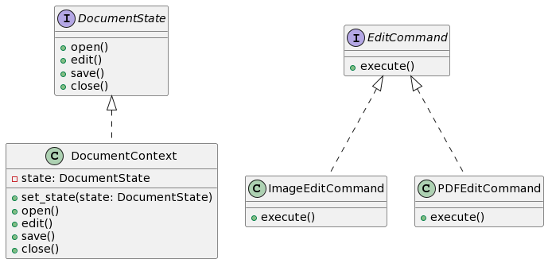

# Proposta 4: Uso do State e Command Patterns

## Problema Resolvido:

- Gerenciar os diferentes estágios de processamento de documentos.
- Criar uma fila de comandos para operações de edição.

## Sample:

Você quer gerenciar os diferentes estados de processamento de documentos (aberto, editando, salvo, fechado) e criar uma fila de comandos para realizar operações de edição em documentos.

## Classes e Objetos:

1. **DocumentState (State)**

- Interface para diferentes estados de um documento.
- Métodos: open, edit, save, close

2. **DocumentContext (State)**

- Mantém uma referência para o estado atual do documento.
- Métodos: set_state, open, edit, save, close

3. **EditCommand (Command)**

- Interface para os comandos de edição.
- Métodos: execute

4. **ImageEditCommand (ConcreteCommand)**

- Implementa o comando de edição para imagens.
- Métodos: execute

5. **PDFEditCommand (ConcreteCommand)**

- Implementa o comando de edição para PDFs.
- Métodos: execute

## Diagrama

```
@startuml

interface DocumentState {
    + open()
    + edit()
    + save()
    + close()
}

class DocumentContext {
    - state: DocumentState
    + set_state(state: DocumentState)
    + open()
    + edit()
    + save()
    + close()
}

interface EditCommand {
    + execute()
}

class ImageEditCommand {
    + execute()
}

class PDFEditCommand {
    + execute()
}

DocumentState <|.. DocumentContext
EditCommand <|.. ImageEditCommand
EditCommand <|.. PDFEditCommand

@enduml

```



Nesta proposta, o State Pattern é usado para gerenciar os diferentes estados de processamento de documentos, e o Command Pattern é usado para criar uma fila de comandos de edição.
