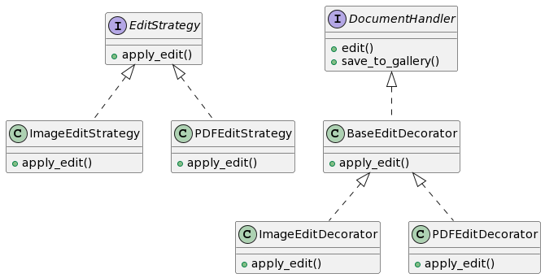

# Proposta 5: Uso do Decorator e Strategy Patterns

## Problema Resolvido:

- Adicionar funcionalidades extras de edição aos handlers de documentos.
- Permitir a escolha de estratégias de edição dinamicamente.

## Sample:

Você quer permitir que os usuários escolham diferentes estratégias de edição para documentos e adicionar funcionalidades extras de edição usando o Decorator Pattern.

## Classes e Objetos:

1. **EditStrategy (Strategy)**

- Interface para estratégias de edição.
- Métodos: apply_edit

2. **ImageEditStrategy (ConcreteStrategy)**

- Implementa estratégias de edição para imagens.
- Métodos: apply_edit

3. **PDFEditStrategy (ConcreteStrategy)**

- Implementa estratégias de edição para PDFs.
- Métodos: apply_edit

4. **DocumentHandler (Component)**

- Interface para os handlers de documentos.
- Métodos: edit, save_to_gallery

5. **BaseEditDecorator (Decorator)**

- Classe base para decorators de edição.
- Métodos: apply_edit

6. **ImageEditDecorator (ConcreteDecorator)**

- Adiciona funcionalidades extras de edição para imagens.
- Métodos: apply_edit

7. **PDFEditDecorator (ConcreteDecorator)**

- Adiciona funcionalidades extras de edição para PDFs.
- Métodos: apply_edit

## Diagrama

```
@startuml

interface EditStrategy {
    + apply_edit()
}

class ImageEditStrategy {
    + apply_edit()
}

class PDFEditStrategy {
    + apply_edit()
}

interface DocumentHandler {
    + edit()
    + save_to_gallery()
}

class BaseEditDecorator {
    + apply_edit()
}

class ImageEditDecorator {
    + apply_edit()
}

class PDFEditDecorator {
    + apply_edit()
}

EditStrategy <|.. ImageEditStrategy
EditStrategy <|.. PDFEditStrategy
DocumentHandler <|.. BaseEditDecorator
BaseEditDecorator <|.. ImageEditDecorator
BaseEditDecorator <|.. PDFEditDecorator

@enduml

```



Nesta proposta, o Strategy Pattern é usado para definir estratégias de edição, e o Decorator Pattern é aplicado para adicionar funcionalidades extras de edição aos handlers de documentos.
