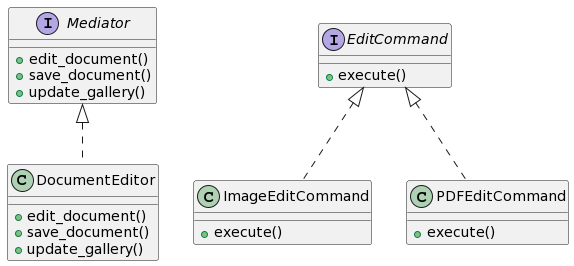

# Proposta 6: Uso do Mediator e Command Patterns

## Problema Resolvido:

- Gerenciar interações entre diferentes partes do sistema.
- Centralizar o controle das operações de edição.

## Sample:

Você deseja centralizar o controle das operações de edição e gerenciar interações entre diferentes componentes do sistema.

## Classes e Objetos:

1. **Mediator (Mediator)**

- Interface que define métodos para mediar a comunicação entre os componentes.
- Métodos: edit_document, save_document, update_gallery

2. **DocumentEditor (ConcreteMediator)**

- Implementa o Mediator e coordena as operações de edição.
- Métodos: edit_document, save_document, update_gallery

3. **EditCommand (Command)**

- Interface para os comandos de edição.
- Métodos: execute

4. **ImageEditCommand (ConcreteCommand)**

- Implementa o comando de edição para imagens.
- Métodos: execute

5. **PDFEditCommand (ConcreteCommand)**

- Implementa o comando de edição para PDFs.
- Métodos: execute

## Diagrama

```
@startuml

interface Mediator {
    + edit_document()
    + save_document()
    + update_gallery()
}

class DocumentEditor {
    + edit_document()
    + save_document()
    + update_gallery()
}

interface EditCommand {
    + execute()
}

class ImageEditCommand {
    + execute()
}

class PDFEditCommand {
    + execute()
}

Mediator <|.. DocumentEditor
EditCommand <|.. ImageEditCommand
EditCommand <|.. PDFEditCommand

@enduml


```



Nesta proposta, o Mediator Pattern é usado para centralizar o controle das operações de edição e coordenar a comunicação entre os componentes do sistema.
