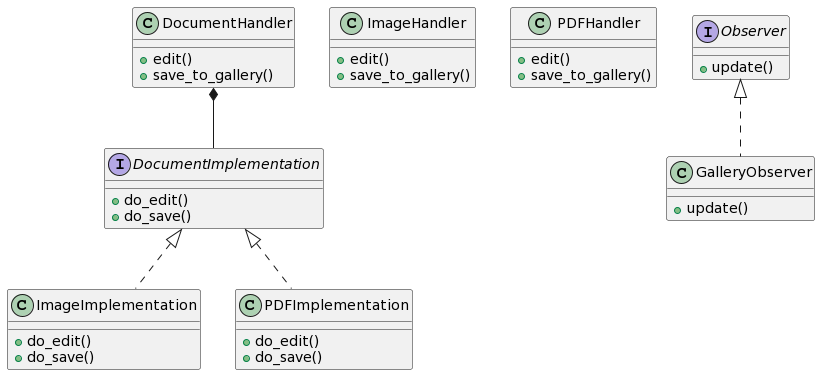

# Proposta 7: Uso do Bridge e Observer Patterns

## Problema Resolvido:

- Separar a abstração da implementação dos handlers de documentos.
- Notificar observadores sobre eventos de edição.

## Sample:

VVocê quer separar a abstração da implementação dos handlers de documentos para permitir extensibilidade e notificar observadores sobre eventos de edição.

## Classes e Objetos:

1. **DocumentHandler (Abstraction)**

- Classe abstrata que define a interface para os handlers de documentos.
- Métodos: edit, save_to_gallery

2. **ImageHandler (RefinedAbstraction)**

- Implementa a abstração para handlers de imagens.
- Métodos: edit, save_to_gallery

3. **PDFHandler (RefinedAbstraction)**

- Implementa a abstração para handlers de PDFs.
- Métodos: edit, save_to_gallery

4. **DocumentImplementation (Implementor)**

- Interface que define os métodos concretos para a implementação dos handlers de documentos.
- Métodos: do_edit, do_save

5. **ImageImplementation (ConcreteImplementor)**

- Implementa a implementação para handlers de imagens.
- Métodos: do_edit, do_save

6. **PDFImplementation (ConcreteImplementor)**

- Implementa a implementação para handlers de PDFs.
- Métodos: do_edit, do_save

7. **Observer (Observer)**

- Interface para observadores de eventos.
- Métodos: update

8. **GalleryObserver (ConcreteObserver)**

- Implementa o observador que recebe notificações sobre eventos de edição.
- Métodos: update

## Diagrama

```
@startuml

class DocumentHandler {
    + edit()
    + save_to_gallery()
}

class ImageHandler {
    + edit()
    + save_to_gallery()
}

class PDFHandler {
    + edit()
    + save_to_gallery()
}

interface DocumentImplementation {
    + do_edit()
    + do_save()
}

class ImageImplementation {
    + do_edit()
    + do_save()
}

class PDFImplementation {
    + do_edit()
    + do_save()
}

interface Observer {
    + update()
}

class GalleryObserver {
    + update()
}

DocumentHandler *-- DocumentImplementation
DocumentImplementation <|.. ImageImplementation
DocumentImplementation <|.. PDFImplementation
Observer <|.. GalleryObserver

@enduml

```



Nesta proposta, o Bridge Pattern é usado para separar a abstração da implementação dos handlers de documentos, e o Observer Pattern é aplicado para notificar observadores sobre eventos de edição.
