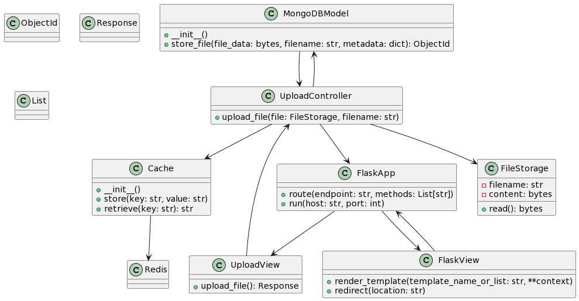

# _Diagrama de Classes_

Aqui está um possível diagrama de classes para a aplicação, com base no exemplo de funcionamento descrito no documento "funcionamento-aplicacao.md". Lembre-se de que este é apenas um exemplo ilustrativo e a estrutura real pode variar de acordo com a complexidade do projeto

Este diagrama de classes representa as principais entidades e seus relacionamentos no contexto do exemplo de funcionamento da aplicação. Aqui estão algumas explicações sobre as entidades, métodos e relacionamentos presentes no diagrama:

- **MongoDBModel:** Representa a classe que interage com o banco de dados MongoDB para armazenar arquivos e metadados associados. Possui um método store_file para realizar a inserção no banco de dados.

- **UploadView:** Representa a classe que lida com as requisições de upload de arquivos, exibe a interface de upload de arquivos e captura os dados do formulário. Possui um método upload_file que retorna uma resposta de redirecionamento ou renderização.

- **UploadController:** Atua como intermediário entre a View e o Model. Recebe as requisições da View, executa a lógica de negócios necessária e interage com o Model para armazenar o arquivo. Utiliza o MongoDBModel para armazenar arquivos e metadados, e também utiliza a classe Cache para caching (mesmo que o caso de uso atual não exija caching).

- **Cache:** Representa a classe responsável pelo caching de dados. Aqui, é usado como exemplo para ilustrar como o padrão poderia ser aplicado em outras partes da aplicação.

- **FlaskApp:** Representa a classe que inicializa o aplicativo Flask e define as rotas. Ela interage com as views e controladores.

- **FlaskView:** Representa a classe base para as views que utilizam o Flask para renderização de templates e redirecionamento.

- **FileStorage:** Representa a classe que contém os dados do arquivo enviado pelo usuário, como nome do arquivo e conteúdo. Possui um método read() para ler o conteúdo do arquivo.

- **ObjectId:** Representa um tipo de dado utilizado pelo MongoDB para identificar documentos.

- **Response:** Representa uma resposta HTTP que pode ser retornada pelas views e controladores.

- **List:** Representa uma lista de elementos.

Este diagrama de classes ajuda a visualizar como as diferentes entidades se relacionam no contexto do padrão MVC e do exemplo de funcionamento da aplicação. As setas representam a direção dos relacionamentos entre as classes. Note que alguns métodos e atributos estão representados no diagrama, mas os detalhes de implementação podem variar com base nas tecnologias específicas e nos detalhes do projeto.
