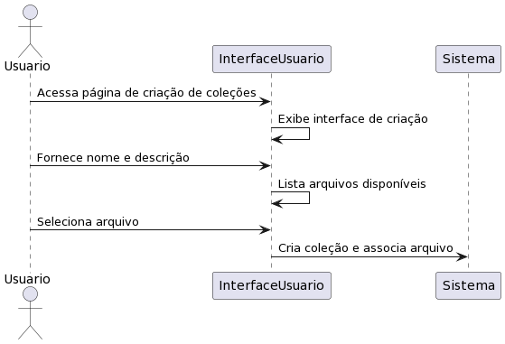
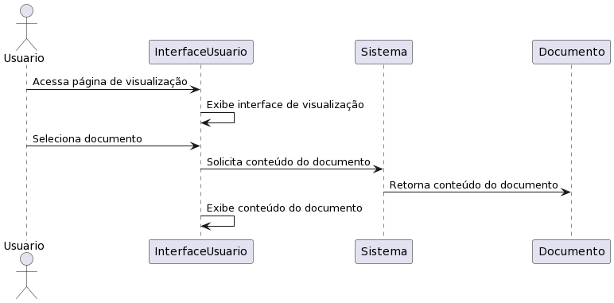
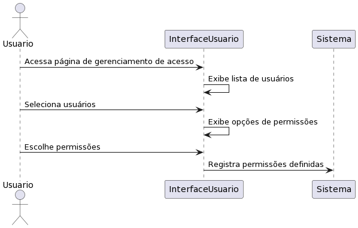
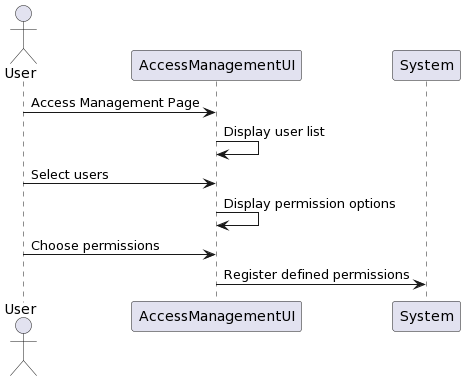
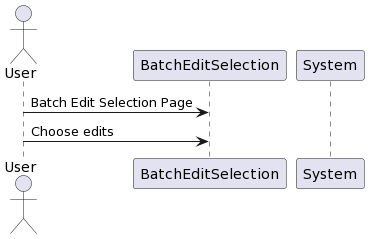
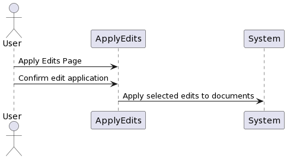

Claro, vou criar um diagrama de casos de uso com base nas informações fornecidas no documento "Casos-de-uso.md". No entanto, devido às limitações do formato de texto aqui, vou criar um diagrama simplificado usando PlantUML para representar os principais atores e casos de uso. Aqui está o diagrama:

```
@startuml
left to right direction

actor User as U
rectangle "Realizar Upload de Arquivo" as Upload
rectangle "Criar Coleção" as CriarColecao
rectangle "Visualizar Documento" as Visualizar
rectangle "Editar Documento" as Editar
rectangle "Definir Acesso" as DefinirAcesso
rectangle "Revogar Acesso" as RevogarAcesso
rectangle "Selecionar Texto" as SelecionarTexto
rectangle "Realizar Tradução" as RealizarTraducao

U --> Upload
U --> CriarColecao
U --> Visualizar
U --> Editar
U --> DefinirAcesso
U --> RevogarAcesso
U --> SelecionarTexto
U --> RealizarTraducao

@enduml

```

Este diagrama representa as interações entre o ator "Usuário" e os diferentes casos de uso no seu documento.

Agora, vamos passar para a explicação do padrão MVC (Model-View-Controller) e dos design patterns (padrões de projeto) Proxy, Observer, Template Method e Strategy, juntamente com seus respectivos diagramas UML usando o PlantUML. Como esse é um processo detalhado, vou dividir em várias respostas para evitar exceder o limite de caracteres. Começarei com a explicação do padrão MVC. Em seguida, continuarei com os outros padrões de design e seus diagramas. Vamos começar:

# **Padrão de Arquitetura MVC (Model-View-Controller):**

O padrão de arquitetura MVC é frequentemente usado em desenvolvimento de software para separar a lógica de negócios, a apresentação e a interação do usuário em componentes distintos. Ele é composto por três componentes principais:

- **Model (Modelo):** Representa os dados e a lógica de negócios da aplicação. Ele lida com o armazenamento, manipulação e validação dos dados. O Model notifica as Views sobre mudanças nos dados usando o padrão Observer.

- **View (Visão):** Responsável por apresentar os dados ao usuário. Ela exibe informações e interage com o usuário. A View também envia os comandos do usuário ao Controller.

- **Controller (Controlador):** Gerencia a interação do usuário e atua como intermediário entre o Model e a View. Ele recebe os comandos do usuário da View, atualiza o Model conforme necessário e atualiza a View com os dados do Model.

Diagrama UML do MVC:

```
@startuml
class Model {
  +getData()
  +updateData()
}

class View {
  +displayData()
}

class Controller {
  +handleUserInput()
}

Model --> Controller : Notifica
Model --> View : Notifica
View --> Controller : Envia Comandos
Controller --> Model : Atualiza
Controller --> View : Atualiza

@enduml

```


Isso completa a explicação do padrão MVC. Agora vou prosseguir com a explicação do padrão de design Proxy.

## Padrão de Design Proxy:

O padrão Proxy é um padrão estrutural que permite controlar o acesso a um objeto, agindo como intermediário entre o cliente e o objeto real. Ele é útil em cenários onde você deseja controlar a criação, acesso ou execução de um objeto, sem alterar a lógica principal do objeto.

O Proxy pode ter diferentes tipos, como Proxy Virtual, Proxy Remoto e Proxy de Proteção.

Diagrama UML do Proxy:

```
@startuml
class Subject {
  +request()
}

class RealSubject {
  +request()
}

class Proxy {
  -realSubject: RealSubject
  +request()
}

Subject <|-- RealSubject
Subject <|-- Proxy
Proxy --> RealSubject

@enduml

```


## Padrão de Design Observer:

O padrão Observer é um padrão comportamental que define uma dependência um-para-muitos entre objetos, de modo que quando um objeto muda de estado, todos os seus dependentes são notificados e atualizados automaticamente.

Diagrama UML do Observer:

```
@startuml
class Subject {
  +attach(observer: Observer)
  +detach(observer: Observer)
  +notify()
}

interface Observer {
  +update()
}

class ConcreteSubject {
  -state
  +setState(state)
  +getState()
}

class ConcreteObserver {
  -subject: Subject
  +update()
}

Subject --> Observer
ConcreteSubject --> Subject
ConcreteObserver --> Observer
ConcreteObserver --> ConcreteSubject

@enduml

```


## Padrão de Design Template Method:

O padrão Template Method é um padrão comportamental que define a estrutura de um algoritmo em uma classe base, permitindo que subclasses implementem detalhes específicos do algoritmo. Ele permite que você defina o esqueleto do algoritmo em uma classe base, enquanto os detalhes específicos são implementados nas subclasses.

Diagrama UML do Template Method:

```
@startuml
abstract class AbstractClass {
  +templateMethod()
  -primitiveOperation1()
  -primitiveOperation2()
}

class ConcreteClassA {
  +primitiveOperation1()
  +primitiveOperation2()
}

class ConcreteClassB {
  +primitiveOperation1()
  +primitiveOperation2()
}

AbstractClass <|-- ConcreteClassA
AbstractClass <|-- ConcreteClassB

@enduml

```


## Padrão de Design Strategy:

O padrão Strategy é um padrão comportamental que permite definir uma família de algoritmos, encapsulá-los em classes separadas e torná-los intercambiáveis. Isso permite que o cliente escolha dinamicamente um algoritmo específico a ser usado.

Diagrama UML do Strategy:

```
@startuml
interface Strategy {
  +algorithm()
}

class ConcreteStrategyA {
  +algorithm()
}

class ConcreteStrategyB {
  +algorithm()
}

class Context {
  -strategy: Strategy
  +setStrategy(strategy: Strategy)
  +executeAlgorithm()
}

Context --> Strategy
Context --> ConcreteStrategyA
Context --> ConcreteStrategyB
@enduml

```


Esses são os padrões Proxy, Observer, Template Method e Strategy, juntamente com seus diagramas UML correspondentes. Eles oferecem abordagens eficazes para resolver diferentes tipos de problemas de design em sistemas de software. Se você quiser saber mais detalhes sobre a implementação de algum desses padrões ou tiver mais perguntas, sinta-se à vontade para perguntar!

## Diagrama de Classes

Claro, vou criar um diagrama de classes baseado nas informações que você forneceu nos casos de uso e nos padrões de design mencionados. Por favor, note que o diagrama será uma representação simplificada e genérica, pois o espaço aqui é limitado. Certifique-se de adaptá-lo às necessidades específicas do seu sistema.

```
@startuml
class Usuario {
  -id: int
  -nome: string
  -email: string
  +autenticar()
  +criarDocumento()
  +editarDocumento()
}

class Documento {
  -id: int
  -titulo: string
  -conteudo: string
}

class Colecao {
  -id: int
  -nome: string
  -descricao: string
  +adicionarDocumento(documento: Documento)
}

class ServicoArmazenamento {
  +carregarArquivo(arquivo: Arquivo)
  +armazenarDocumento(documento: Documento)
}

class ServicoTraducao {
  +traduzirTexto(texto: string, idiomaOrigem: string, idiomaDestino: string)
}

class InterfaceUsuario {
  +exibirPaginaUpload()
  +exibirPaginaCriacaoColecao()
  +exibirPaginaVisualizacaoDocumentos()
  +exibirPaginaEdicaoDocumento()
  +exibirPaginaGerenciamentoAcesso()
  +exibirPaginaSelecaoDocumentos()
  +exibirPaginaEscolhaEdicoes()
}

Usuario --> Documento
Usuario --> Colecao
Usuario --> ServicoArmazenamento
Usuario --> ServicoTraducao
Usuario --> InterfaceUsuario

Documento --> Colecao

Colecao --> Documento

ServicoArmazenamento --> Documento

ServicoTraducao --> Documento

InterfaceUsuario --> Usuario
InterfaceUsuario --> Documento
InterfaceUsuario --> Colecao
InterfaceUsuario --> ServicoTraducao
InterfaceUsuario --> ServicoArmazenamento

@enduml

```


Este é um diagrama de classes simplificado que representa a estrutura básica do seu sistema. Ele inclui classes como Usuario, Documento, Colecao, ServicoArmazenamento, ServicoTraducao e InterfaceUsuario. Lembre-se de que você deve ajustar esse diagrama de acordo com os requisitos específicos do seu sistema e também considerar a implementação dos padrões de design discutidos anteriormente (Proxy, Observer, Template Method e Strategy).

---

## Diagramas de Sequencia

Vou criar alguns diagramas de sequência com base nos casos de uso que você forneceu. Novamente, lembre-se de que os diagramas são representações simplificadas e genéricas. Você pode adaptá-los de acordo com as necessidades específicas do seu sistema.

### Diagrama de Sequência: Realizar Upload de Arquivo

```
@startuml
actor Usuario
participant InterfaceUsuario
participant ServicoArmazenamento
participant Sistema

Usuario -> InterfaceUsuario: Acessa página de upload
InterfaceUsuario -> InterfaceUsuario: Exibe interface de upload
Usuario -> InterfaceUsuario: Seleciona arquivo
InterfaceUsuario -> InterfaceUsuario: Valida arquivo
InterfaceUsuario -> ServicoArmazenamento: Envia arquivo para armazenamento
ServicoArmazenamento -> Sistema: Armazena arquivo
ServicoArmazenamento -> Sistema: Registra metadados do arquivo
@enduml

```


### Diagrama de Sequência: Criar Coleção

```
@startuml
actor Usuario
participant InterfaceUsuario
participant Sistema

Usuario -> InterfaceUsuario: Acessa página de criação de coleções
InterfaceUsuario -> InterfaceUsuario: Exibe interface de criação
Usuario -> InterfaceUsuario: Fornece nome e descrição
InterfaceUsuario -> InterfaceUsuario: Lista arquivos disponíveis
Usuario -> InterfaceUsuario: Seleciona arquivo
InterfaceUsuario -> Sistema: Cria coleção e associa arquivo
@enduml

```



### Diagrama de Sequência: Visualizar Documento

```
@startuml
actor Usuario
participant InterfaceUsuario
participant Sistema
participant Documento

Usuario -> InterfaceUsuario: Acessa página de visualização
InterfaceUsuario -> InterfaceUsuario: Exibe interface de visualização
Usuario -> InterfaceUsuario: Seleciona documento
InterfaceUsuario -> Sistema: Solicita conteúdo do documento
Sistema -> Documento: Retorna conteúdo do documento
InterfaceUsuario -> InterfaceUsuario: Exibe conteúdo do documento
@enduml
```



## Diagrama de Sequência: Editar Documento

```
@startuml
actor Usuario
participant InterfaceUsuario
participant Sistema
participant Documento

Usuario -> InterfaceUsuario: Acessa página de edição
InterfaceUsuario -> InterfaceUsuario: Exibe interface de edição
Usuario -> InterfaceUsuario: Seleciona documento
InterfaceUsuario -> Sistema: Solicita conteúdo do documento
Sistema -> Documento: Retorna conteúdo do documento
InterfaceUsuario -> InterfaceUsuario: Exibe conteúdo do documento
Usuario -> InterfaceUsuario: Realiza edições
InterfaceUsuario -> InterfaceUsuario: Registra edições
@enduml

```


## Diagrama de Sequência: Definir Acesso

```
@startuml
actor Usuario
participant InterfaceUsuario
participant Sistema

Usuario -> InterfaceUsuario: Acessa página de gerenciamento de acesso
InterfaceUsuario -> InterfaceUsuario: Exibe lista de usuários
Usuario -> InterfaceUsuario: Seleciona usuários
InterfaceUsuario -> InterfaceUsuario: Exibe opções de permissões
Usuario -> InterfaceUsuario: Escolhe permissões
InterfaceUsuario -> Sistema: Registra permissões definidas
@enduml

```



---

## Diagrama de Sequencia: Revogar Acesso

```
@startuml
actor User
participant AccessManagementUI
participant System

User -> AccessManagementUI: Access Management Page
AccessManagementUI -> AccessManagementUI: Display user list
User -> AccessManagementUI: Select users
AccessManagementUI -> AccessManagementUI: Display permission options
User -> AccessManagementUI: Choose permissions
AccessManagementUI -> System: Register defined permissions
@enduml
```



---

## Diagrama de Sequencia: Selecionar Texto

```
@startuml
actor User
participant DocumentAccess
participant System

User -> DocumentAccess: Access Document
User -> DocumentAccess: Select text
DocumentAccess -> System: Highlight text
@enduml

```


---

## Diagrama de Sequência: Realizar Tradução

```
@startuml
actor User
participant DocumentAccess
participant TranslationService
participant System

User -> DocumentAccess: Access Document
User -> DocumentAccess: Select text
User -> DocumentAccess: Choose translation
DocumentAccess -> TranslationService: Translate text
TranslationService -> System: Return translated text
@enduml
```


---

## Diagrama de Sequência: Selecionar Documentos

```
@startuml
actor User
participant BatchEditSelection
participant System

User -> BatchEditSelection: Batch Edit Selection Page
User -> BatchEditSelection: Choose documents
@enduml

```


---

## Diagrama de Sequência: Escolher Edições em Lote

```
@startuml
actor User
participant BatchEditSelection
participant System

User -> BatchEditSelection: Batch Edit Selection Page
User -> BatchEditSelection: Choose edits
@enduml

```



---

## Diagrama de Sequência: Aplicar Edições

```
@startuml
actor User
participant ApplyEdits
participant System

User -> ApplyEdits: Apply Edits Page
User -> ApplyEdits: Confirm edit application
ApplyEdits -> System: Apply selected edits to documents
@enduml

```

## 

Estes são exemplos simples de diagramas de sequência para alguns dos casos de uso que você forneceu. Eles representam interações entre atores, interfaces do usuário, serviços e o sistema. Lembre-se de que você pode ajustar os diagramas para refletir com mais precisão as ações e interações específicas do seu sistema.
