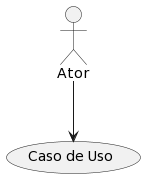
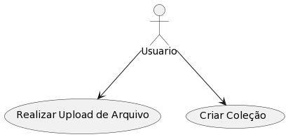
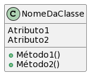
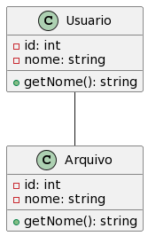
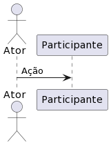
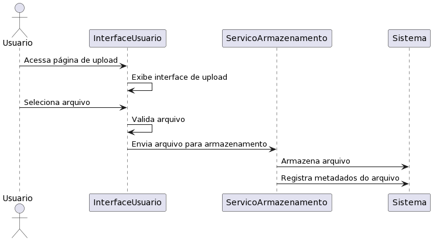
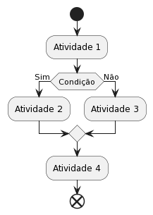
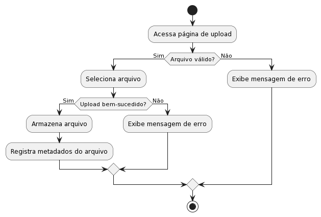
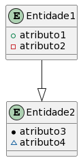
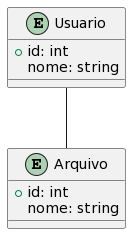

# Tutorial: Construindo Diagramas UML no PlantUML

## 1. Instalação e Configuração

Primeiro, certifique-se de ter o PlantUML instalado. Você pode encontrá-lo em https://plantuml.com/download. Siga as instruções para a instalação correta de acordo com o seu sistema operacional.

## 2. Casos de Uso

### 2.1. Sintaxe Básica de Casos de Uso

```
@startuml
actor Ator
usecase "Caso de Uso" as UC
Ator --> UC
@enduml
```



### 2.2. Exemplo de Casos de Uso

```
@startuml
actor Usuario
usecase "Realizar Upload de Arquivo" as Upload
usecase "Criar Coleção" as Criar
Usuario --> Upload
Usuario --> Criar
@enduml
```



## 3. Diagrama de Classes

### 3.1. Sintaxe Básica de Diagrama de Classes

```
@startuml
class NomeDaClasse {
  Atributo1
  Atributo2
  +Método1()
  +Método2()
}
@enduml
```



### 3.2. Exemplo de Diagrama de Classes

```
@startuml
class Usuario {
  -id: int
  -nome: string
  +getNome(): string
}
class Arquivo {
  -id: int
  -nome: string
  +getNome(): string
}
Usuario -- Arquivo
@enduml
```



## 4. Diagrama de Sequência

### 4.1. Sintaxe Básica de Diagrama de Sequência

```
@startuml
actor Ator
participant Participante
Ator -> Participante: Ação
@enduml
```



### 4.2. Exemplo de Diagrama de Sequência

```
@startuml
actor Usuario
participant InterfaceUsuario
participant ServicoArmazenamento
participant Sistema

Usuario -> InterfaceUsuario: Acessa página de upload
InterfaceUsuario -> InterfaceUsuario: Exibe interface de upload
Usuario -> InterfaceUsuario: Seleciona arquivo
InterfaceUsuario -> InterfaceUsuario: Valida arquivo
InterfaceUsuario -> ServicoArmazenamento: Envia arquivo para armazenamento
ServicoArmazenamento -> Sistema: Armazena arquivo
ServicoArmazenamento -> Sistema: Registra metadados do arquivo
@enduml
```



## 5. Diagrama de Atividades

### 5.1. Sintaxe Básica de Diagrama de Atividades

```
@startuml
start
:Atividade 1;
if (Condição) then (Sim)
:Atividade 2;
else (Não)
:Atividade 3;
endif
:Atividade 4;
end
@enduml
```



### 5.2. Exemplo de Diagrama de Atividades

```
@startuml
start
:Acessa página de upload;
if (Arquivo válido?) then (Sim)
:Seleciona arquivo;
if (Upload bem-sucedido?) then (Sim)
:Armazena arquivo;
:Registra metadados do arquivo;
else (Não)
:Exibe mensagem de erro;
endif
else (Não)
:Exibe mensagem de erro;
endif
stop
@enduml
```



## 6. Diagrama Entidade-Relacionamento (DER)

### 6.1. Sintaxe Básica de Diagrama Entidade-Relacionamento

```
@startuml
entity Entidade1 {
+atributo1
-atributo2
}
entity Entidade2 {
*atributo3
~atributo4
}
Entidade1 --|> Entidade2
@enduml
```



### 6.2. Exemplo de Diagrama Entidade-Relacionamento

```
@startuml
entity Usuario {
+id: int
nome: string
}
entity Arquivo {
+id: int
nome: string
}
Usuario -- Arquivo
@enduml
```

## 

Esse tutorial cobriu os diagramas UML mais comuns. Lembre-se de que o PlantUML oferece uma grande flexibilidade para personalização e detalhamento. À medida que você se familiariza com a sintaxe, você pode adicionar mais detalhes e personalizar ainda mais seus diagramas.

A documentação oficial do PlantUML (https://plantuml.com) é uma excelente fonte de referência para explorar todas as opções disponíveis e criar diagramas mais complexos.

http://www.plantuml.com/plantuml/uml/SyfFKj2rKt3CoKnELR1Io4ZDoSa70000
